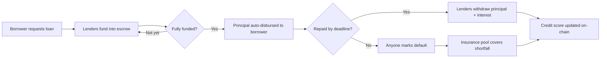

# 🕸️ CreditMesh
Demo Link : https://www.youtube.com/watch?v=m86bdl6D0Qs
**Decentralized peer-to-peer micro-lending with on-chain credit scores, built on Stellar Soroban.**

CreditMesh lets anyone request a loan, and lets a mesh of lenders collectively fund it — no banks, no middlemen. Every repayment (or default) is recorded on-chain and feeds a transparent credit score, while a shared insurance pool protects lenders when borrowers default.

---

## 📜 Deployed Contract

| | |
|---|---|
| **Network** | Stellar Testnet |
| **Contract Address** | `CAEFU3SKK7E5H7DXAMNZ62KV3OWHS4E3XZOJLDUMSM2KHYQ5ZIBGLHFR` |
| **Lending Token** | Native XLM (SAC: `CDLZFC3SYJYDZT7K67VZ75HPJVIEUVNIXF47ZG2FB2RMQQVU2HHGCYSC`) |
| **Explorer** | [View on Stellar Expert](https://stellar.expert/explorer/testnet/contract/CAEFU3SKK7E5H7DXAMNZ62KV3OWHS4E3XZOJLDUMSM2KHYQ5ZIBGLHFR) |

## 🏗️ Project Structure

```text
credit-mesh
├── contract/    # Soroban smart contract (Rust)
│   └── contracts/contract/src/lib.rs   # All lending logic lives here
├── client/      # Next.js frontend (React 19, Tailwind, Stellar Wallets Kit)
│   ├── src/                            # App pages, components, hooks, lib
│   └── packages/contract/              # Generated TypeScript contract bindings
├── scripts/     # Deployment & operations scripts
│   ├── deploy.sh                       # Build + deploy + initialize on testnet
│   ├── init.mjs                        # One-time initialize(token) for a deployed contract
│   └── verify-fund.mjs                 # Sanity-check that fund_loan simulates cleanly
└── README.md
```

## ✨ Features

- 💸 **Request loans** — borrowers set the amount, term, and APR; funds are disbursed automatically once fully funded
- 🤝 **Crowd-funded lending** — multiple lenders each contribute a portion of a loan; contributions are held in escrow
- 📊 **On-chain credit scores** — repayment history (on-time, late, defaulted) is tracked per user and computed into a score
- 🛡️ **Default-insurance pool** — a community pool covers lender shortfalls when a loan defaults
- 💰 **Proportional payouts** — lenders withdraw principal + interest pro-rata to their contribution
- ⚡ **Real-time dashboard** — wallet balance, credit score, loan marketplace, and live activity feed

## 🔄 How It Works — End to End

### 1. The loan lifecycle



1. **Request** — a borrower calls `request_loan(amount, term_secs, apr_bps)`. The loan starts in `Pending` status with a unique id.
2. **Fund** — lenders call `fund_loan(loan_id, amount)`. XLM moves from the lender's wallet into the contract's escrow. Contributions are tracked per lender.
3. **Disburse** — the moment total funding equals the principal, the loan flips to `Active`, the deadline clock starts (`now + term_secs`), and the full principal is transferred to the borrower automatically — in the same transaction as the final contribution.
4. **Repay** — the borrower calls `repay(loan_id, amount)` one or more times. Total due = `principal + principal × apr_bps / 10000`. When fully repaid, the loan becomes `Repaid` and each lender's claim (principal + interest, pro-rata) is settled.
5. **Withdraw** — lenders call `withdraw(loan_id)` to pull their payout from escrow.
6. **Default** — if the deadline passes and the loan isn't fully repaid, *anyone* can call `mark_default(loan_id)`. Whatever was repaid, topped up by the insurance pool, is distributed to lenders pro-rata.

### 2. Credit scores

Scores start at **600** and are clamped to **[300, 900]**:

| Event | Effect |
|---|---|
| On-time full repayment | **+100** (capped at +300 total) |
| Late full repayment | **−50** each |
| Default | **−150** each (capped at −300 total) |

Everything is derived from on-chain `UserStats` — no off-chain oracle, fully auditable.

### 3. Insurance pool

Anyone can call `deposit_pool(amount)` to strengthen the network. When a loan defaults, the pool covers the lenders' shortfall (up to its balance). This mutualizes risk across the mesh.

## 📑 Smart Contract API

| Function | Who | Description |
|---|---|---|
| `initialize(token)` | deployer, once | Set the lending token (native XLM SAC on testnet) |
| `request_loan(borrower, amount, term_secs, apr_bps)` | borrower | Create a loan request, returns loan id |
| `fund_loan(lender, loan_id, amount)` | lender | Fund part of a pending loan into escrow |
| `repay(borrower, loan_id, amount)` | borrower | Repay principal + interest (partial ok) |
| `withdraw(lender, loan_id)` | lender | Withdraw payout after Repaid/Defaulted |
| `deposit_pool(depositor, amount)` | anyone | Add funds to the insurance pool |
| `mark_default(loan_id)` | anyone | Trigger default after deadline passes |
| `get_loan(loan_id)` / `loans_count()` | read | Loan details / total count |
| `loan_contributions(loan_id)` | read | Per-lender contribution map |
| `claimable(lender, loan_id)` | read | Lender's withdrawable amount |
| `credit_score(user)` / `user_stats(user)` | read | On-chain score / raw stats |
| `pool_balance()` | read | Insurance pool balance |

## 🚀 Getting Started

### Prerequisites

- [Bun](https://bun.sh/) 1.x (and [Node.js](https://nodejs.org/) 20+ for the ops scripts)
- A Stellar wallet browser extension ([Freighter](https://freighter.app/) recommended) funded with **testnet** XLM ([Friendbot](https://friendbot.stellar.org))
- (Contract development only) Rust + [Stellar CLI](https://developers.stellar.org/docs/tools/cli)

### Run the app

```bash
cd client
bun install    # installs deps + auto-compiles the contract bindings
bun run dev    # start the dev server
```

Open [http://localhost:3000](http://localhost:3000), connect your wallet (set to **Testnet**), and you're in:

- **Marketplace** — browse, create, and fund loans
- **Dashboard** — your balance, credit score, borrowing/lending stats
- **Activity** — live on-chain event feed and your transaction history

### Try the full flow (2 wallets)

1. Wallet A: *Marketplace → Request Loan* (e.g. 100 XLM, 7 days, 12% APR)
2. Wallet B: *Fund this loan* → funds sit in escrow; when funding hits 100%, Wallet A receives the XLM instantly
3. Wallet A: *Repay* 112 XLM before the deadline
4. Wallet B: *Withdraw* 112 XLM (principal + interest) — and Wallet A's credit score climbs to 700 🎉

## 🛰️ Deployment

Deploy your own instance to testnet:

```bash
./scripts/deploy.sh [identity-name]   # builds, deploys, and initializes with native XLM
```

Then point the client at it in `client/.env.local`:

```bash
NEXT_PUBLIC_CONTRACT_ID=C...YOUR_NEW_CONTRACT_ID
```

### Operations scripts

| Script | Purpose |
|---|---|
| `scripts/deploy.sh` | Build the Rust contract, deploy to testnet, and call `initialize` |
| `scripts/init.mjs` | Initialize an already-deployed contract with the native XLM token (idempotent — safe to re-run) |
| `scripts/verify-fund.mjs` | Simulate `fund_loan` against the deployed contract to verify it's healthy |

```bash
node scripts/init.mjs                 # heal a deployed-but-uninitialized contract
node scripts/verify-fund.mjs          # ✅ prints success if funding works end-to-end
```

> ⚠️ **Important:** the contract *must* be initialized after deployment. An uninitialized contract fails every money-moving call with `Error(WasmVm, InvalidAction)`.

## 🧪 Testing the contract

```bash
cd contract
cargo test          # runs the unit tests in contracts/contract/src/test.rs
```

## 🛠️ Tech Stack

| Layer | Technology |
|---|---|
| Smart contract | Rust, Soroban SDK |
| Contract bindings | `stellar contract bindings typescript` (in `client/packages/contract`) |
| Frontend | Next.js 16, React 19, TypeScript, Tailwind CSS 4, Radix UI (managed with Bun) |
| State/data | TanStack Query (polling reads), Zustand (wallet + tx state) |
| Blockchain | Stellar Testnet, Soroban RPC, `@stellar/stellar-sdk` |
| Wallets | Stellar Wallets Kit — Freighter, Albedo, xBull, LOBSTR, Hana, … |

## 🔍 Troubleshooting

| Symptom | Cause | Fix |
|---|---|---|
| `Error(WasmVm, InvalidAction)` on fund/repay/deposit | Contract not initialized with a token | `node scripts/init.mjs` |
| `Error(Contract, #3)` when funding | Loan is no longer `Pending` | Refresh — someone fully funded it already |
| `Error(Contract, #4)` when funding | Amount exceeds what the loan still needs | Fund at most the remaining amount |
| Wallet has no XLM | Testnet account unfunded | Fund via [Friendbot](https://friendbot.stellar.org) |
| Bindings import error (`Can't resolve 'contract'`) | Bindings not compiled | `cd client && bun install` (or `bun run prebuild`) |

---

Made with ❤️ on Stellar
