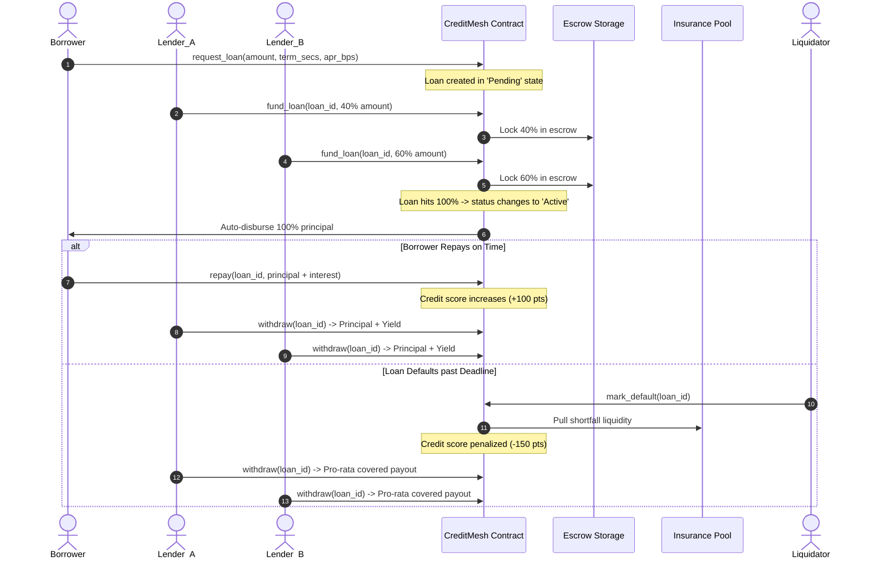

# 🕸️ CreditMesh

<div align="center">

[](https://github.com/dwaghale/Credit-Mesh/actions/workflows/ci.yml)
[](https://soroban.stellar.org)
[-black?logo=next.js)](https://nextjs.org)
[](https://www.typescriptlang.org)
[](https://tailwindcss.com)
[](LICENSE)

**Decentralized peer-to-peer micro-lending with on-chain credit scores and mutualized default insurance, built on Stellar Soroban.**

[Live Demo Video](https://www.youtube.com/watch?v=m86bdl6D0Qs) · [Testnet Contract Explorer](https://stellar.expert/explorer/testnet/contract/CAEFU3SKK7E5H7DXAMNZ62KV3OWHS4E3XZOJLDUMSM2KHYQ5ZIBGLHFR) · [Report Bug](https://github.com/dwaghale/Credit-Mesh/issues)

</div>

---

## 📖 Table of Contents

- [Overview](#-overview)
- [System Architecture](#-system-architecture)
- [Deployed Smart Contract](#-deployed-smart-contract)
- [Key Features](#-key-features)
- [How It Works](#-how-it-works)
  - [1. Loan Lifecycle](#1-loan-lifecycle)
  - [2. On-Chain Credit Scoring](#2-on-chain-credit-scoring)
  - [3. Default-Insurance Pool](#3-default-insurance-pool)
- [UI/UX & Mobile Experience](#-uiux--mobile-experience)
- [Smart Contract API & Events](#-smart-contract-api--events)
- [CI/CD Pipeline](#-cicd-pipeline)
- [Getting Started](#-getting-started)
- [Testing](#-testing)
- [Troubleshooting](#-troubleshooting)

---

## 🌟 Overview

**CreditMesh** is a transparent, non-custodial crowdlending protocol designed to bridge capital providers and borrowers directly on Stellar Soroban.

Traditional micro-lending suffers from predatory middleman fees, opaque credit evaluations, and fragmented risk. CreditMesh resolves this by:
1. **Multi-Lender Co-Funding**: Multiple community lenders contribute fractional capital into smart contract escrow.
2. **Deterministic Credit Reputation**: Borrower scores (300–900) are derived solely from audited on-chain repayment history.
3. **Mutualized Default Insurance**: A community-backed reserve automatically absorbs unpaid balances if deadlines expire.

---

## 🏛️ System Architecture

```mermaid
flowchart TD
    subgraph Client_Layer["🖥️ Frontend Layer (Next.js 15 + TypeScript + Tailwind 4)"]
        UI[Responsive Web App]
        SWK[Stellar Wallets Kit\n(Freighter, Albedo, xBull, LOBSTR)]
        TQ[TanStack Query Polling Cache]
        ZS[Zustand Stores\n(Wallet & Tx History)]
    end

    subgraph Stellar_Network["⚡ Stellar Network (Testnet)"]
        RPC[Soroban RPC Endpoint\nhttps://soroban-testnet.stellar.org]
        HORIZON[Horizon API\nhttps://horizon-testnet.stellar.org]
    end

    subgraph Soroban_Contracts["📜 Smart Contract Layer (Rust)"]
        CM_CONTRACT["CreditMesh Smart Contract\nCAEFU3SK...GLHFR"]
        SAC_TOKEN["Native XLM SAC Token\nCDLZFC3S...CYSC"]
        ESCROW[Contract Escrow & Pool Storage]
        CREDIT_ENGINE[On-Chain Credit Scoring]
    end

    UI --> SWK
    UI --> TQ
    UI --> ZS
    SWK -->|Sign XDR Transactions| RPC
    TQ -->|Poll State & Events| RPC
    RPC --> CM_CONTRACT
    CM_CONTRACT --> SAC_TOKEN
    CM_CONTRACT --> ESCROW
    CM_CONTRACT --> CREDIT_ENGINE
    UI -->|Query Balances| HORIZON
```

### Layer Breakdown

- **Smart Contract (`/contract`)**: Written in Rust using Soroban SDK. Encapsulates loan creation, fractional escrow, auto-disbursal, repayment accounting, default liquidations, and on-chain credit scores.
- **Frontend App (`/client`)**: Next.js 15 App Router with Tailwind CSS v4, Lucide icons, Sonner notifications, and Radix UI components.
- **Contract Bindings (`/client/packages/contract`)**: Auto-generated TypeScript types and Client SDK compiled directly from contract Wasm specs.
- **Wallet Integration**: `@creit.tech/stellar-wallets-kit` providing seamless connection to Freighter, Albedo, xBull, LOBSTR, Hana, and browser wallets.

---

## 📜 Deployed Smart Contract

| Parameter | Value |
|---|---|
| **Network** | Stellar Testnet |
| **Contract ID** | `CAEFU3SKK7E5H7DXAMNZ62KV3OWHS4E3XZOJLDUMSM2KHYQ5ZIBGLHFR` |
| **Lending Asset** | Native XLM (`CDLZFC3SYJYDZT7K67VZ75HPJVIEUVNIXF47ZG2FB2RMQQVU2HHGCYSC`) |
| **RPC Endpoint** | `https://soroban-testnet.stellar.org` |
| **Network Passphrase** | `Test SDF Network ; September 2015` |
| **Block Explorer** | [View on Stellar Expert](https://stellar.expert/explorer/testnet/contract/CAEFU3SKK7E5H7DXAMNZ62KV3OWHS4E3XZOJLDUMSM2KHYQ5ZIBGLHFR) |

---

## ✨ Key Features

- 💸 **P2P Loan Creation**: Borrowers specify principal amount, duration (7, 14, 30, 90 days), and offered APR.
- 🤝 **Crowdfunded Fractional Escrow**: Multiple lenders co-fund any amount; funds remain locked in contract escrow until 100% target is reached.
- ⚡ **Atomic Auto-Disbursal**: The transaction completing 100% funding immediately triggers automatic payout to the borrower.
- 📊 **Decentralized Credit Reputation**: Transparent 300–900 point score calculated mathematically without off-chain black-box APIs.
- 🛡️ **Default-Insurance Backstop**: Community insurance pool covers lender shortfalls if repayment deadlines lapse.
- 📱 **Mobile-First Responsive Interface**: Full mobile support with slide-out drawer, touch targets, and responsive grids.
- 🔔 **Instant Toast Feedback**: Live transaction tracking with Sonner toasts linked directly to Stellar Expert.

---

## 🔄 How It Works

### 1. Loan Lifecycle



### 2. On-Chain Credit Scoring

Credit scores initialize at **600** and are bounded within **[300, 900]**:

$$\text{Score} = \text{clamp}\Big(600 + (\text{OnTime} \times 100) - (\text{Late} \times 50) - (\text{Defaults} \times 150),\, 300,\, 900\Big)$$

| Event | On-Chain Impact | Tier Qualification |
|---|---|---|
| **On-Time Full Repayment** | **+100 Points** | **750 – 900**: Excellent Tier (Max borrowing capacity) |
| **Late Full Repayment** | **−50 Points** | **650 – 749**: Good Tier (Standard rates) |
| **Loan Default** | **−150 Points** | **500 – 649**: Fair Tier \| **300 – 499**: Poor Tier |

### 3. Default-Insurance Pool

Anyone can deposit XLM into the protocol's insurance pool (`deposit_pool`). When a borrower defaults past their repayment deadline:
1. `mark_default(loan_id)` calculates the remaining unpaid balance.
2. The contract transfers the required coverage from pool reserves into the loan payout balance.
3. Lenders withdraw their pro-rata portion safely without incurring total capital loss.

---

## 📱 UI/UX & Mobile Experience

- **Responsive Navigation**: Adaptive header with mobile hamburger slide-out drawer, route indicators, and network status pill.
- **Interactive Loan Calculator**: Live calculation of total interest and total repayment amounts based on principal and APR sliders.
- **Quick Preset Actions**: One-click presets for loan funding (25%, 50%, 75%, 100%), repayment, and pool deposits.
- **Glassmorphic Theme System**: High-contrast dark and light modes with OkLCH color tokens, ambient glows, and clean cards.
- **Real-Time Notification System**: Sonner toast alerts with transaction hash copies and direct explorer links.

---

## 📑 Smart Contract API & Events

### Functions

| Function | Caller | Description |
|---|---|---|
| `initialize(token)` | Deployer (Once) | Configures the native XLM token SAC address. |
| `request_loan(borrower, amount, term_secs, apr_bps)` | Borrower | Initiates a loan request in `Pending` state. |
| `fund_loan(lender, loan_id, amount)` | Lender | Escrows XLM towards a pending loan. |
| `repay(borrower, loan_id, amount)` | Borrower | Repays principal + interest (partial or full). |
| `withdraw(lender, loan_id)` | Lender | Withdraws principal + yield after repayment or default settlement. |
| `deposit_pool(depositor, amount)` | Anyone | Adds funds to the mutualized insurance pool. |
| `mark_default(loan_id)` | Anyone | Triggers default settlement backed by the insurance pool. |
| `get_loan(loan_id)` | Read-only | Returns loan details (principal, funded, repaid, deadline, status). |
| `credit_score(user)` | Read-only | Returns on-chain credit score (300–900). |
| `pool_balance()` | Read-only | Returns current insurance pool reserves. |

### Contract Events

- `loan_req`: Emitted when a borrower opens a new loan request.
- `funded`: Emitted when a lender contributes escrowed capital.
- `repaid`: Emitted when a borrower repays loan debt.
- `default`: Emitted when a loan default is triggered and covered.
- `pool_dep`: Emitted when liquidity is deposited into the insurance pool.
- `withdrew`: Emitted when a lender claims their settlement payout.

---

## 🚀 CI/CD Pipeline

CreditMesh includes a comprehensive **GitHub Actions CI/CD workflow** (`.github/workflows/ci.yml`):

```
┌────────────────────────────────────────────────────────┐
│               GitHub Actions CI Pipeline               │
├───────────────────────────┬────────────────────────────┤
│       Frontend CI         │      Smart Contract CI     │
├───────────────────────────┼────────────────────────────┤
│ • Setup Bun & Node.js 20  │ • Setup Rust & Wasm Target │
│ • TypeScript Typecheck    │ • Cargo Format Check       │
│ • ESLint Validation       │ • Cargo Clippy Linter      │
│ • Next.js Production Build│ • Soroban Unit Tests       │
└───────────────────────────┴────────────────────────────┘
```

---

## 🛠️ Getting Started

### Prerequisites

- [Bun](https://bun.sh/) 1.x or [Node.js](https://nodejs.org/) 20+
- A Stellar testnet-funded wallet (e.g. [Freighter](https://freighter.app/) funded via [Friendbot](https://friendbot.stellar.org))

### 1. Clone & Install

```bash
git clone https://github.com/dwaghale/Credit-Mesh.git
cd Credit-Mesh/client
bun install
```

### 2. Start Development Server

```bash
bun run dev
```

Open [http://localhost:3000](http://localhost:3000) in your browser.

---

## 🧪 Testing

### Test Smart Contract (Rust)

```bash
cd contract
cargo test
```

### Test Frontend (Lint & Typecheck)

```bash
cd client
bun run lint
bunx tsc --noEmit
bun run build
```

---

## 🔍 Troubleshooting

| Issue | Cause | Resolution |
|---|---|---|
| `Error(WasmVm, InvalidAction)` | Contract uninitialized | Run `node scripts/init.mjs` |
| `Error(Contract, #3)` | Loan not in `Pending` state | Refresh list; loan already reached 100% funding |
| `Error(Contract, #4)` | Overfunding loan | Fund up to the exact remaining amount |
| Wallet not connecting | Extension locked or wrong network | Unlock Freighter and switch network to **Testnet** |
| Bindings unresolved | Contract package unbuilt | Run `cd client && bun run prebuild` |

---

## 📄 License

This project is licensed under the [MIT License](LICENSE).

<div align="center">
Built with ❤️ on Stellar Soroban
</div>
